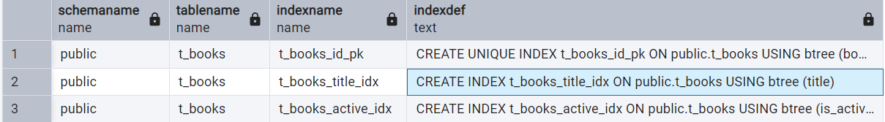
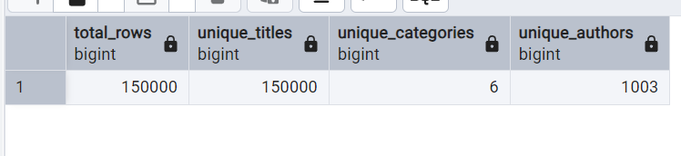

# Задание 1. B-tree индексы в PostgreSQL

1. Запустите БД через docker compose в ./src/docker-compose.yml:

2. Выполните запрос для поиска книги с названием 'Oracle Core' и получите план выполнения:
   ```sql
   EXPLAIN ANALYZE
   SELECT * FROM t_books WHERE title = 'Oracle Core';
   ```
   
   *План выполнения:*
   ```
    "Seq Scan on t_books  (cost=0.00..3100.00 rows=1 width=33) (actual time=17.173..17.175 rows=1 loops=1)"
    "  Filter: ((title)::text = 'Oracle Core'::text)"
    "  Rows Removed by Filter: 149999"
    "Planning Time: 0.116 ms"
    "Execution Time: 17.189 ms"
   ```   
   *Объясните результат:*
   Так как отсутсвует индекс по данному столбцу, оптимизатору необходимо прочитать всю таблицу 

3. Создайте B-tree индексы:
   ```sql
   CREATE INDEX t_books_title_idx ON t_books(title);
   CREATE INDEX t_books_active_idx ON t_books(is_active);
   ```
   
   *Результат:*
   ```
   CREATE INDEX
    ```

4. Проверьте информацию о созданных индексах:
   ```sql
   SELECT schemaname, tablename, indexname, indexdef
   FROM pg_catalog.pg_indexes
   WHERE tablename = 't_books';
   ```
   
   *Результат:*
   
   
   *Объясните результат:*
   Показаны два созданных нами индекса и индекс для первичного ключа, который создается автоматически 

5. Обновите статистику таблицы:
   ```sql
   ANALYZE t_books;
   ```
   
   *Результат:*
   ```
   INFO:  analyzing "public.t_books"
   INFO:  "t_books": scanned 1225 of 1225 pages, containing 150000 live rows and 3 dead rows; 30000 rows in sample, 150000 estimated total rows
   ANALYZE
   ```
6. Выполните запрос для поиска книги 'Oracle Core' и получите план выполнения:
   ```sql
   EXPLAIN ANALYZE
   SELECT * FROM t_books WHERE title = 'Oracle Core';
   ```
   
   *План выполнения:*
   ```
   "Index Scan using t_books_title_idx on t_books  (cost=0.42..8.44 rows=1 width=33) (actual time=0.050..0.051 rows=1 loops=1)"
   "Index Cond: ((title)::text = 'Oracle Core'::text)"
   "Planning Time: 0.256 ms"
   "Execution Time: 0.064 ms"
   ```   
   *Объясните результат:*
   Так как мы создали индекс на title время выполнения сократилось примерно в 250 раз с 17.189 мс до 0.064 мс 

7. Выполните запрос для поиска книги по book_id и получите план выполнения:
   ```sql
   EXPLAIN ANALYZE
   SELECT * FROM t_books WHERE book_id = 18;
   ```
   
   *План выполнения:*
   ```
   "Index Scan using t_books_id_pk on t_books  (cost=0.42..8.44 rows=1 width=33) (actual time=0.031..0.033 rows=1 loops=1)"
   "Index Cond: (book_id = 18)"
   "Planning Time: 0.109 ms"
   "Execution Time: 0.057 ms"
   ```   
   *Объясните результат:*
   В данном случае будет использован индекс, так как мы ищем по первичному ключу для которого автоматически создается B-Tree индекс  
8. Выполните запрос для поиска активных книг и получите план выполнения:
   ```sql
   EXPLAIN ANALYZE
   SELECT * FROM t_books WHERE is_active = true;
   ```
   
   *План выполнения:*
   ```
   "Seq Scan on t_books  (cost=0.00..2725.00 rows=74240 width=33) (actual time=0.023..25.415 rows=74711 loops=1)"
   "Filter: is_active"
   "Rows Removed by Filter: 75289"
   "Planning Time: 0.252 ms"
   "Execution Time: 29.011 ms"
   ```   
   *Объясните результат:*
   В данном случае колонка содержит всего два значения, поэтому B-tree индекс не может быть эффективно использован 

9. Посчитайте количество строк и уникальных значений:
   ```sql
   SELECT 
       COUNT(*) as total_rows,
       COUNT(DISTINCT title) as unique_titles,
       COUNT(DISTINCT category) as unique_categories,
       COUNT(DISTINCT author) as unique_authors
   FROM t_books;
   ```
   
   *Результат:*
   

10. Удалите созданные индексы:
    ```sql
    DROP INDEX t_books_title_idx;
    DROP INDEX t_books_active_idx;
    ```
    
    *Результат:*
    ```
    DROP INDEX

    Query returned successfully in 152 msec.
    ```
11. Основываясь на предыдущих результатах, создайте индексы для оптимизации следующих запросов:
    a. `WHERE title = $1 AND category = $2`
    b. `WHERE title = $1`
    c. `WHERE category = $1 AND author = $2`
    d. `WHERE author = $1 AND book_id = $2`
    
    *Созданные индексы:*
    ```Sql
    -- 1
    CREATE INDEX some_index ON t_books(title, category);
    -- 2
    CREATE INDEX hs_index ON t_books USING HASH(title);
    -- 3 
    CREATE INDEX one_more_index ON t_books(category, author);
    -- 4 
    CREATE INDEX eche_odin_index ON t_books(author, book_id);

    ```
    
    *Объясните ваше решение:*
    Для пооиска по одной колонке по точному совпадению HASH индекс является предпочтительным, так как он выполнется быстрее чем B-tree индекс. Это подтверждают тесты. Однако он не может бысть построен на основе нескольких столбцов. Для таких ситуаций более предпочтителен B-tree индекс. Также будет доступна возможность поиска по диапазону


    *Тест скорости индексов для точного сопадения:*
    ```sql
    CREATE INDEX ord_index ON t_books(title);

    EXPLAIN ANALYZE 
    SELECT * FROM t_books WHERE title = 'Book_10';
    ```
    ```
    "Index Scan using ord_index on t_books  (cost=0.42..8.44 rows=1 width=33) (actual time=0.029..0.030 rows=1 loops=1)"
    "Index Cond: ((title)::text = 'Book_10'::text)"
    "Planning Time: 0.150 ms"
    "Execution Time: 0.047 ms"
    ```

    ```sql
    DROP INDEX ord_index; 
    -- 
    CREATE INDEX hs_index ON t_books USING HASH(title);

    EXPLAIN ANALYZE 
    SELECT * FROM t_books WHERE title = 'Book_10';
    ```
    ```
    "Index Scan using hs_index on t_books  (cost=0.00..8.02 rows=1 width=33) (actual time=0.017..0.018 rows=1 loops=1)"
    "Index Cond: ((title)::text = 'Book_10'::text)"
    "Planning Time: 0.122 ms"
    "Execution Time: 0.034 ms"
    ```
    ```sql
    DROP INDEX hs_index;
    ```

12. Протестируйте созданные индексы.
    
    *Результаты тестов:*
    ```sql
    EXPLAIN ANALYZE SELECT * FROM t_books  WHERE title = 'Book_96' AND category = 'Fiction';
    ```
    ```
    "Index Scan using hs_index on t_books  (cost=0.00..8.02 rows=1 width=33) (actual time=0.019..0.021 rows=1 loops=1)"
    "Index Cond: ((title)::text = 'Book_96'::text)"
    "Filter: ((category)::text = 'Fiction'::text)"
    "Planning Time: 0.700 ms"
    "Execution Time: 0.049 ms"
    ```
     (Оптимизатор решил использоавть HASH индекс а не B-tree для двух столбцов, так как для точного совпадения он бдует быстрее)
    ```sql
    EXPLAIN ANALYZE SELECT * FROM t_books WHERE title = 'Book_100';
    ```
    ```
    "Index Scan using hs_index on t_books  (cost=0.00..8.02 rows=1 width=33) (actual time=0.026..0.027 rows=1 loops=1)"
    "Index Cond: ((title)::text = 'Book_100'::text)"
    "Planning Time: 0.224 ms"
    "Execution Time: 0.054 ms"
    ```
    ```sql
    EXPLAIN ANALYZE SELECT * FROM t_books WHERE category = 'Fiction' AND author = 'Author_70'; 
    ```
    ```
    "Recheck Cond: (((category)::text = 'Fiction'::text) AND ((author)::text = 'Author_70'::text))"
    "Heap Blocks: exact=30"
    "->  Bitmap Index Scan on one_more_index  (cost=0.00..4.59 rows=30 width=0) (actual time=0.043..0.043 rows=31 loops=1)"
    "Index Cond: (((category)::text = 'Fiction'::text) AND ((author)::text = 'Author_70'::text))"
    "Planning Time: 0.322 ms"
    "Execution Time: 0.251 ms"
    ```
    ```sql
    EXPLAIN ANALYZE SELECT * FROM t_books WHERE author = 'Author_70' AND book_id = 2;
    ```
    ```
    "Index Scan using eche_odin_index on t_books  (cost=0.42..8.44 rows=1 width=33) (actual time=0.081..0.083 rows=0 loops=1)"
    "Index Cond: (((author)::text = 'Author_70'::text) AND (book_id = 2))"
    "Planning Time: 0.292 ms"
    "Execution Time: 0.134 ms"
    ```
   
    
    *Объясните результаты:*
    Для 1 и 3 запроса оптмизитор преподчел не использоавть созданные под них индексы 

13. Выполните регистронезависимый поиск по началу названия:
    ```sql
    EXPLAIN ANALYZE
    SELECT * FROM t_books WHERE title ILIKE 'Relational%';
    ```
    
    *План выполнения:*
    ```
    "Seq Scan on t_books  (cost=0.00..3100.00 rows=15 width=33) (actual time=142.023..142.024 rows=0 loops=1)"
    "Filter: ((title)::text ~~* 'Relational%'::text)"
    "Rows Removed by Filter: 150000"
    "Planning Time: 0.176 ms"
    "Execution Time: 142.046 ms"
    ```
    
    *Объясните результат:*
    Оптимизатор решил не использоавть индекс some_index с первым столбцом title по данной  причине: "It is also possible to use B-tree indexes for ILIKE and ~*, but only if the pattern starts with non-alphabetic characters, i.e., characters that are not affected by upper/lower case conversion." 

    Даже для LIKE оптимизатор не будет использоавть B-tree так как моя Бд не использует C locale:
    The optimizer can also use a B-tree index for queries involving the pattern matching operators LIKE and ~ if the pattern is a constant and is anchored to the beginning of the string — for example, col LIKE 'foo%' or col ~ '^foo', but not col LIKE '%bar'. However, if your database does not use the C locale you will need to create the index with a special operator class to support indexing of pattern-matching queries 

    (см. https://www.postgresql.org/docs/current/indexes-types.html)

    Пруф по поводу C locale: 
    ```sql
    SELECT datname, datcollate FROM pg_database;
    ```
    ```
    "postgres"	"en_US.utf8"
    "workshop"	"en_US.utf8"
    "template1"	"en_US.utf8"
    "template0"	"en_US.utf8"
    ```


14. Создайте функциональный индекс:
    ```sql
    CREATE INDEX t_books_up_title_idx ON t_books(UPPER(title));
    ```
    
    *Результат:*
    ```
    CREATE INDEX

    Query returned successfully in 1 secs 42 msec.
    ```
15. Выполните запрос из шага 13 с использованием UPPER:
    ```sql
    EXPLAIN ANALYZE
    SELECT * FROM t_books WHERE UPPER(title) LIKE 'RELATIONAL%';
    ```
    
    *План выполнения:*
    "Seq Scan on t_books  (cost=0.00..3475.00 rows=750 width=33) (actual time=126.473..126.474 rows=0 loops=1)"
    "Filter: (upper((title)::text) ~~ 'RELATIONAL%'::text)"
    "Rows Removed by Filter: 150000"
    "Planning Time: 47.404 ms"
    "Execution Time: 126.504 ms"    
    *Объясните результат:*
    По описанной выше причине индекс не бдует использоавться 

16. Выполните поиск подстроки:
    ```sql
    EXPLAIN ANALYZE
    SELECT * FROM t_books WHERE title ILIKE '%Core%';
    ```
    
    *План выполнения:*
    ```
    "Seq Scan on t_books  (cost=0.00..3100.00 rows=15 width=33) (actual time=229.548..229.557 rows=1 loops=1)"
    "Filter: ((title)::text ~~* '%Core%'::text)"
    "Rows Removed by Filter: 149999"
    "Planning Time: 0.987 ms"
    "Execution Time: 229.818 ms"
    ```
    
    *Объясните результат:*
    Даже если индекс бы и мог применяться для LIKE и ILIKE, он не был бы применен так как в начале может идти неопредленное количесвто символов 

17. Попробуйте удалить все индексы:
    ```sql
    DO $$ 
    DECLARE
        r RECORD;
    BEGIN
        FOR r IN (SELECT indexname FROM pg_indexes 
                  WHERE tablename = 't_books' 
                  AND indexname != 'books_pkey')
        LOOP
            EXECUTE 'DROP INDEX ' || r.indexname;
        END LOOP;
    END $$;
    ```
    
    *Результат:*
    ```
    ERROR:  cannot drop index t_books_id_pk because constraint t_books_id_pk on table t_books requires it
    HINT:  You can drop constraint t_books_id_pk on table t_books instead.
    CONTEXT:  SQL statement "DROP INDEX t_books_id_pk"
    PL/pgSQL function inline_code_block line 9 at EXECUTE
    ```
    
    *Объясните результат:*
    Мы попытались удалить индекс для первичного ключа, что привело к ошибке, так как он должен существовать для проверки уникальности первичного ключа 

18. Создайте индекс для оптимизации суффиксного поиска:
    ```sql
    -- Вариант 1: с reverse()
    CREATE INDEX t_books_rev_title_idx ON t_books(reverse(title));
    
    -- Вариант 2: с триграммами
    CREATE EXTENSION IF NOT EXISTS pg_trgm;
    CREATE INDEX t_books_trgm_idx ON t_books USING gin (title gin_trgm_ops);
    ```
    
    *Результаты тестов:*
    [Вставьте планы выполнения для обоих вариантов]
    
    *Объясните результаты:*
    [Ваше объяснение]

19. Выполните поиск по точному совпадению:
    ```sql
    EXPLAIN ANALYZE
    SELECT * FROM t_books WHERE title = 'Oracle Core';
    ```
    
    *План выполнения:*
    ```
    --1 
    CREATE INDEX
    --2 
    CREATE INDEX
    ```    
    *Объясните результат:*
    Оба индекса были успешно созданы


20. Выполните поиск по началу названия:
    ```sql
    EXPLAIN ANALYZE
    SELECT * FROM t_books WHERE title ILIKE 'Relational%';
    ```
    
    *План выполнения:*
    "Bitmap Heap Scan on t_books  (cost=95.15..150.36 rows=15 width=33) (actual time=0.055..0.055 rows=0 loops=1)"
    "Recheck Cond: ((title)::text ~~* 'Relational%'::text)"
    "Rows Removed by Index Recheck: 1"
    "Heap Blocks: exact=1"
    "->  Bitmap Index Scan on t_books_trgm_idx  (cost=0.00..95.15 rows=15 width=0) (actual time=0.045..0.045 rows=1 loops=1)"
    "Index Cond: ((title)::text ~~* 'Relational%'::text)"
    "Planning Time: 0.433 ms"
    "Execution Time: 0.084 ms"
    
    *Объясните результат:*
    Для обработки данного запроса оптимизатор использовал сочетение bitmap и trimm индекса


21. Создайте свой пример индекса с обратной сортировкой:
    ```sql
    CREATE INDEX t_books_desc_idx ON t_books(title DESC);
    ```
    
    *Тестовый запрос:*
    ```sql
    EXPLAIN ANALYZE SELECT 	title FROM t_books ORDER BY title DESC;
    ```
    
    *План выполнения:*
    ```
    "Index Only Scan using t_books_desc_idx on t_books  (cost=0.42..4585.45 rows=150000 width=11) (actual time=0.043..15.151 rows=150000 loops=1)"
    "Heap Fetches: 364"
    "Planning Time: 0.461 ms"
    "Execution Time: 19.371 ms"
    ```    
    *Объясните результат:*
    Обычно в B-дереве значения отсоритроавны в возр порядке, в данном индексе будет наоборот. Собрать все результаты убывающем порядке, бдует быстрее в индексе который уже отсортироавн в убывающем порядке 